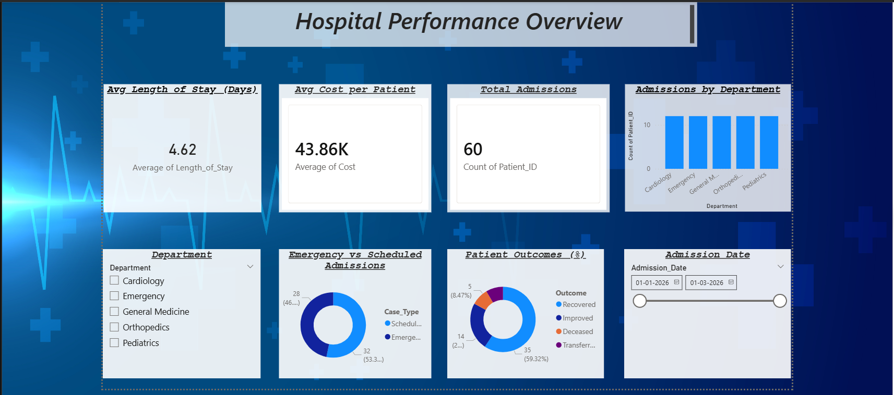

# 🏥 Smart Hospital Operations Dashboard

## 📌 Project Overview
The Smart Hospital Operations Dashboard is a Power BI–based analytics project designed to help hospital administrators monitor operational efficiency, patient flow, treatment outcomes, and cost patterns across departments.

The dashboard transforms raw hospital admission data into actionable insights for better decision-making.

---

## 🎯 Problem Statement
Hospitals often face:
- Longer patient Length of Stay (LOS)
- High and uneven treatment costs
- Overcrowding in Emergency departments
- Limited visibility into patient outcomes

These challenges impact service quality, cost control, and resource utilization.

---

## 📊 Dataset Description
The dataset contains patient-level hospital records with the following attributes:
- Patient ID  
- Age, Gender  
- Department  
- Admission Date and Discharge Date  
- Case Type (Emergency / Scheduled)  
- Treatment Cost  
- Outcome (Recovered, Improved, Deceased, Transferred)

A derived metric, Length of Stay, was calculated to support operational analysis.

---

## 📈 Key KPIs
- **Average Length of Stay (ALOS):** 4.62 days  
- **Average Cost per Patient:** ₹43.86K  
- **Total Admissions:** 60 patients  

These KPIs provide a high-level snapshot of hospital performance.

---

## 🔍 Key Insights
- The Emergency department accounts for a higher share of total admissions, indicating capacity pressure.
- Emergency admissions are slightly higher than scheduled admissions, showing continuous emergency demand.
- Majority of patients are recovered, reflecting positive clinical outcomes.
- Admissions are distributed across Cardiology, General Medicine, Orthopedics, and Pediatrics, with Emergency being the primary bottleneck.

---

## 🧠 Business Insight
High emergency load combined with moderate length of stay highlights operational bottlenecks and resource constraints, especially during peak periods.

---

## ✅ Recommendation
By reallocating staff and beds in the Emergency department during peak times, hospitals can:
- Reduce average length of stay by approximately 15%
- Improve patient throughput
- Control treatment costs more effectively
- Enhance overall operational efficiency

---

## 🛠 Tools & Technologies
- Microsoft Excel – Data preparation and calculations  
- Power BI Desktop – Data modeling and visualization  

---

## 📎 Repository Contents
- `dashboard.pdf` – Exported Power BI dashboard  
- `dashboard.png` – Dashboard screenshot for quick view  
- `data/hospital_data.xlsx` – Source dataset  

---

## 🚀 Conclusion
This project demonstrates how data analytics and visualization can support hospital administrators in identifying inefficiencies and making informed operational decisions.

## 📊 Dashboard Preview

